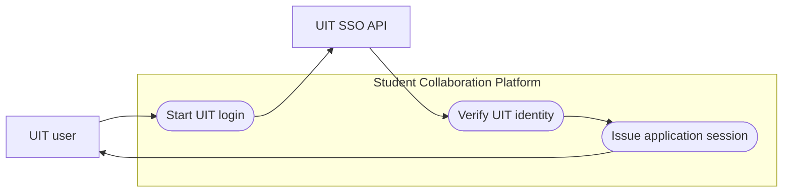
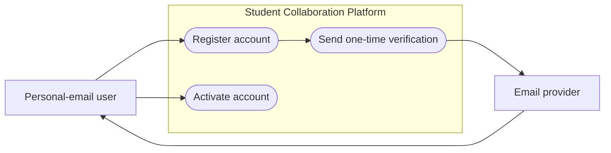
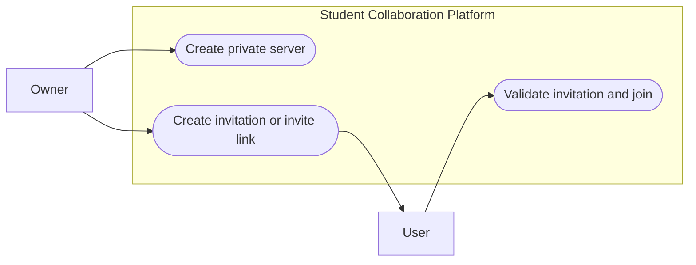
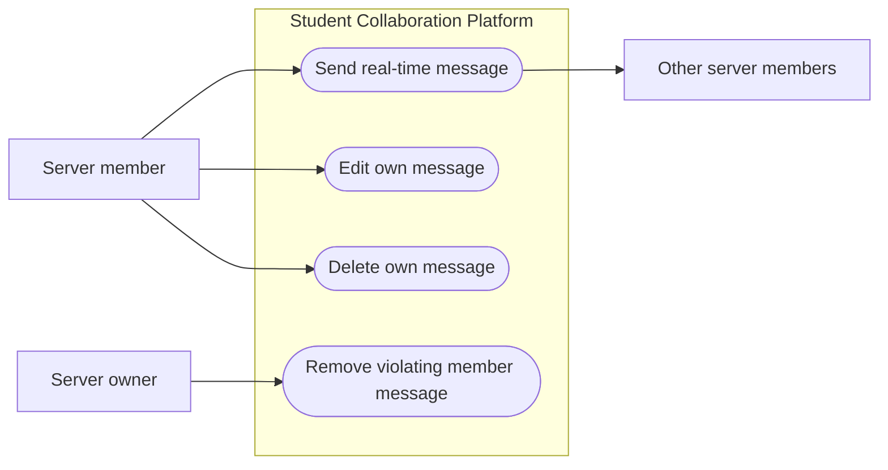
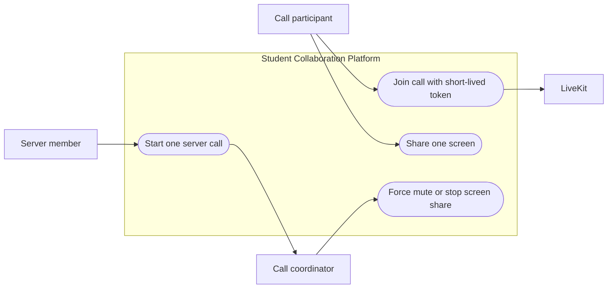
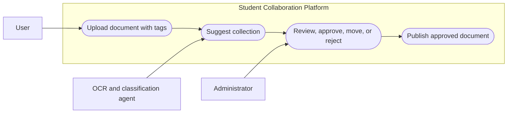
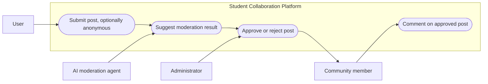
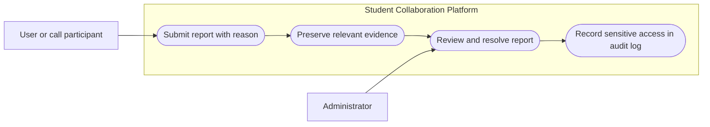

# System Architecture and Core Execution Flows

## 1. Architectural decisions

| Decision                   | Proposed approach                                                                                                                                                                | Why it fits this project                                                                                                                                                 |
| -------------------------- | -------------------------------------------------------------------------------------------------------------------------------------------------------------------------------- | ------------------------------------------------------------------------------------------------------------------------------------------------------------------------ |
| Application shape          | A modular monolith for the Spring Boot business backend                                                                                                                          | The target scale and student-project timeline do not justify independently deployed domain services. Modules still keep clear boundaries for later extraction if needed. |
| Frontend                   | React application with separate user and administrator routes                                                                                                                    | React can reuse authentication, API, state, and design components while still protecting administrator views with server-side authorization.                             |
| Main application interface | HTTPS REST APIs for commands, queries, uploads, and LiveKit-token requests                                                                                                       | REST is simple to test, trace, and secure for business operations.                                                                                                       |
| Real-time delivery         | A Socket.IO gateway that relays authorised chat, presence, and notification events                                                                                               | Socket.IO provides reconnection and room-based fan-out. The gateway is only a real-time adapter; Spring Boot remains the source of business rules and persisted state.   |
| Video and screen sharing   | LiveKit for WebRTC media; Spring Boot issues short-lived LiveKit tokens after permission checks                                                                                  | The application does not need to build or operate its own media protocol. LiveKit is responsible for audio, video, and screen tracks.                                    |
| Persistence                | PostgreSQL for transactional data; S3-compatible object storage for document files; Redis for cache, rate limiting, and Socket.IO fan-out when more than one gateway is deployed | The data is strongly relational, while files and temporary processing artifacts should not be stored in the relational database.                                         |
| Search                     | PostgreSQL full-text search over approved documents and posts at the initial scale                                                                                               | It meets the stated scope without adding a dedicated search platform. The OCR text is indexed only for approved documents.                                               |
| AI support                 | Background OCR and AI jobs create recommendations only                                                                                                                           | Document classification and forum moderation always remain subject to an explicit administrator decision.                                                                |
| Privacy and audit          | Sensitive administrator reads are purpose-limited and recorded in an immutable audit log                                                                                         | This implements the stated limits on private chat, calls, and anonymous identities.                                                                                      |

## 2. Logical architecture

The architecture has five logical layers.

| Layer                            | Main elements                                                                        | Responsibility                                                                                                                                                              |
| -------------------------------- | ------------------------------------------------------------------------------------ | --------------------------------------------------------------------------------------------------------------------------------------------------------------------------- |
| Client layer                     | React user application, React administrator dashboard, LiveKit web client            | Renders the interface, sends authenticated REST requests, receives Socket.IO events, and connects directly to LiveKit only with a short-lived token.                        |
| Edge and real-time layer         | HTTPS reverse proxy, Socket.IO gateway                                               | Terminates client connections, validates a session before room membership, broadcasts approved events to server and user rooms, and handles reconnection.                   |
| Business layer                   | Spring Boot modules                                                                  | Owns validation, authorization, transactions, lifecycle rules, moderation decisions, audit records, and all public APIs.                                                    |
| Background-processing layer      | Worker processes and a job queue                                                     | Runs OCR, virus scanning, AI recommendation jobs, search indexing, notification delivery, and scheduled data-retention jobs without delaying the user request.              |
| Data and external-services layer | PostgreSQL, Redis, object storage, LiveKit, UIT SSO, email provider, OCR/AI provider | Stores durable data and supplies specialised capabilities. External services are accessed only by the backend or worker, never with permanent credentials from the browser. |

### 3.1 Business modules and ownership

| Spring Boot module       | Owns                                                                                                     | Important rules                                                                                                                                                   |
| ------------------------ | -------------------------------------------------------------------------------------------------------- | ----------------------------------------------------------------------------------------------------------------------------------------------------------------- |
| Identity and Account     | user profile, account status, application access and refresh tokens, email verification and reset tokens | UIT passwords are never stored. A personal account cannot use an @uit.edu.vn email. Unverified and banned accounts cannot use main features.                      |
| Server and Membership    | server, membership, owner role, invitation, invitation link                                              | Servers are private. A server has one shared chat stream and no subchannels. If no Owner remains, the most recently joined Member is promoted.                    |
| Chat                     | messages, edit state, soft deletion, linked-content previews                                             | Only members can interact. A sender edits or deletes only their own message; an Owner may remove a Member message. Deleted content is retained for up to 90 days. |
| Call Orchestration       | call session, coordinator identity, participant and active-sharer state                                  | At most one active call and one active screen sharer exist per server. The call starter is Coordinator; this role is not transferred when that person leaves.     |
| Document Library         | document submission, collection, tags, moderation state, public visibility                               | A document is not public or searchable until an administrator approves it.                                                                                        |
| Forum                    | post, topic, comment, anonymous alias, moderation state                                                  | Posts require approval; comments on approved posts are immediately visible. A stable anonymous alias exists only inside one post thread.                          |
| Report and Moderation    | report, immutable evidence snapshot, resolution                                                          | Reports preserve the reported context even if the original content changes or is deleted.                                                                         |
| Notification             | per-user in-app notification and read/deletion state                                                     | Notifications are one-way system messages, not direct messages between users.                                                                                     |
| Administration and Audit | administrator actions, sensitive-read audit records                                                      | An administrator may only access data needed to moderate or resolve a report. Every sensitive read is auditable.                                                  |

### 3.2 Supporting components

| Component                  | Responsibility                                                               | Data it may hold                                                                                                              |
| -------------------------- | ---------------------------------------------------------------------------- | ----------------------------------------------------------------------------------------------------------------------------- |
| PostgreSQL                 | Authoritative transactional store                                            | Accounts, roles, servers, messages, call metadata, documents, forum data, reports, notifications, audit logs, and job status. |
| Object storage             | Original uploaded documents, quarantined uploads, generated previews         | File objects only; metadata and access permissions remain in PostgreSQL.                                                      |
| Redis                      | Socket.IO adapter, short-lived cache, rate-limit counters, distributed locks | No unique business records. The system remains recoverable if Redis is cleared.                                               |
| Job queue and workers      | Reliable asynchronous work                                                   | Job references and retries for scans, OCR, AI recommendations, indexing, notifications, and retention.                        |
| LiveKit                    | Real-time media rooms and participant tracks                                 | Ephemeral media-session data. Calls are not recorded by default.                                                              |
| UIT SSO and email provider | UIT authentication and personal-account email flows                          | Only the required identifiers and one-time tokens are exchanged.                                                              |
| OCR and AI provider        | OCR text, suggested document collection, suggested forum moderation result   | A recommendation, confidence, and processing metadata; never the final moderation decision.                                   |

## 3. Key data model and state rules

| Entity                | Essential fields or relationships                                        | State and integrity rule                                                                                                      |
| --------------------- | ------------------------------------------------------------------------ | ----------------------------------------------------------------------------------------------------------------------------- |
| User                  | id, email, account type, status, profile                                 | Personal accounts move through unverified, active, and banned; UIT users are active only after successful UIT SSO.            |
|                       |                                                                          |                                                                                                                               |
| ServerMembership      | server, user, role, joined-at                                            | Role is OWNER or MEMBER; at least one owner is maintained while members exist.                                                |
| Invite                | server, recipient or opaque link token, expiry, maximum uses, uses       | Validate expiry and remaining uses atomically when joining.                                                                   |
| ChatMessage           | server, sender, content, linked-content reference, edited-at, deleted-at | A soft-deleted message is excluded from ordinary chat views but can be exposed only for a relevant report.                    |
| CallSession           | server, coordinator, status, started-at, active-sharer                   | A database constraint and a server-level lock prevent two active calls or two active sharers.                                 |
| Document              | uploader, object key, title, tags, collection, status, OCR text          | Pending processing, pending review, approved, rejected, or removed; only approved is public.                                  |
| ForumPost and Comment | author, content, topics, anonymous flag, status                          | Posts are pending until approved. Comments require an approved parent post.                                                   |
| AnonymousAlias        | post, user, display alias                                                | Unique by the post and user pair so a person remains consistent within one thread but cannot be linked publicly across posts. |
| ReportEvidence        | report, source type, immutable snapshot, captured-at                     | Retain for at most 180 days, independently of the source record.                                                              |
| AuditLog              | administrator, action, target, purpose, timestamp                        | Retain for one year. Required for sensitive chat reads and anonymous-identity reveals.                                        |

## 4. Interfaces, rooms, and trust boundaries

### 4.1 Client interfaces

- React calls Spring Boot APIs over HTTPS for authentication, server management, moderation, search, uploads, report submission, and LiveKit-token requests.
- The browser connects to Socket.IO with a short-lived application access token. The gateway verifies it before allowing the connection into a room.
- Chat messages use a chat-send event with a client-generated request ID. The gateway asks the Chat module to validate and persist the message, then broadcasts a chat-created event only after the transaction succeeds.
- Socket.IO rooms use server-generated names such as server:{serverId} for chat and call-state events, and user:{userId} for personal notifications. Clients never choose arbitrary room names.
- React requests a short-lived LiveKit token from Call Orchestration. LiveKit then carries media directly between the participant and the media service; it does not receive the application database credentials.

### 4.2 Event delivery

The business backend writes an outbox record in the same transaction as a state change that requires real-time delivery. A worker publishes that record to the Socket.IO gateway. This avoids showing an event for a message or moderation decision that was not successfully saved. The client de-duplicates retries with the request ID and can reload the REST resource after reconnection.

### 4.3 Boundaries that must be enforced on the server

- The client may request an action but never grants itself a role, server membership, moderator privilege, or LiveKit permission.
- The Socket.IO gateway must check the authenticated user and current membership before accepting chat, joining a room, or broadcasting to a room.
- LiveKit tokens must be scoped to one call room, one user, a short expiry, and the permitted publish/subscribe abilities.
- File access uses short-lived signed URLs after the backend verifies document status and user permission.
- The AI and OCR workers receive the minimum data required for their task and return suggestions. They cannot publish documents or posts.

## 5. Use case diagrams

### 5.1 Authenticate with UIT SSO

### 5.2 Register and activate a personal account

### 5.3 Create and join a private server

### 5.4 Exchange messages in server chat

### 5.5 Conduct a server video call

### 5.6 Submit and approve a document

### 5.7 Publish and moderate a forum post

### 5.8 Submit and resolve a report

## 6. Core execution flows

### 6.1 Authenticate and create an application session

**UIT account**

1. The React client sends the user to the UIT SSO authorization flow.
2. UIT returns a verified identity to the Spring Boot Identity module.
3. The module creates or updates the internal user profile. It does not store the UIT password.
4. The backend issues a short-lived application access token and a rotating refresh token. The browser receives the session through secure transport.

**Personal-email account**

1. The client submits an email and password to the registration API.
2. Identity rejects @uit.edu.vn emails, hashes the password, creates an unverified account, and stores a time-limited one-time verification token.
3. The Email provider sends the verification link or code.
4. After successful verification, the account becomes active and can receive an application session.
5. Password-reset responses are generic so that the API does not disclose whether an email is registered. A completed password change or reset revokes existing refresh tokens.

### 6.2 Invite a user and join a server

1. An Owner creates a direct invitation or an invite link. The Server module records the expiration and, for links, the remaining allowed uses.
2. A direct invitation is written as a Notification and delivered to the recipient's user room when the recipient is online.
3. The recipient accepts the notification or opens the link.
4. In one transaction, the Server module verifies that the invitation is valid, creates a MEMBER membership, increments the link-use count when relevant, and emits a membership event.
5. The Socket.IO gateway then adds the member's active sockets to the server room. The client reloads the server summary through REST after reconnection.

### 6.3 Send, edit, and remove a chat message

1. A connected member emits a chat-send event with a request ID, server ID, and message content.
2. The gateway validates the access token, current membership, payload size, and rate limit. It passes the command to the Chat module.
3. Chat verifies that the account is active, persists the message and a matching outbox event in one transaction, and returns an acknowledgement.
4. An outbox worker publishes a chat-created event to the relevant server room. All connected members receive the same persisted message ID.
5. For an edit or deletion, the backend verifies authorship. For an Owner removal, it verifies the Owner role and that the target is a Member message.
6. Deletion is soft deletion. The regular chat view excludes it, while evidence attached to a report remains available under the report-access rules.

### 6.4 Start, join, and manage a call

1. A member requests that a call be started. Call Orchestration locks the server row and confirms there is no active call.
2. It creates a CallSession, records the requester as Coordinator, creates or activates the corresponding LiveKit room, and emits the call state.
3. A participant requests a LiveKit token. The backend checks active account status, server membership, active-call status, participant limit of 30, and token scope before issuing a short-lived token.
4. The React client connects to LiveKit with that token; audio, camera, and screen tracks go through LiveKit, while messages remain in the normal server chat.
5. Before screen sharing, the client requests permission from Call Orchestration. A server-level lock ensures only one active sharer can be recorded. The backend then grants the temporary LiveKit publishing permission.
6. Coordinator actions to mute a participant or stop screen sharing are accepted only while the original Coordinator is present in the call. They are implemented through the LiveKit server API and recorded as call-control events.
7. LiveKit participant webhooks update presence. When the final participant leaves, Call Orchestration marks the call ended and clears the active-call reference. No recording is started or stored.

### 6.5 Upload, classify, review, and publish a document

1. An active user submits title, tags, and file metadata. The backend validates type and size, creates a pending-processing record, and returns a short-lived upload URL to quarantined object storage.
2. After the file upload completes, the backend queues malware scanning and OCR. A failed scan moves the item to a safe rejected or quarantined state and is visible only to authorised reviewers.
3. A worker sends the allowed OCR text and tags to the classification agent. The agent returns a suggested existing collection and confidence; it cannot create a collection or publish a document.
4. The document moves to pending review, with the agent result displayed in the administrator dashboard.
5. An administrator selects the final collection, can correct tags, and explicitly approves or rejects the submission. The decision and rejection reason are stored.
6. Approval makes the document visible in the public library, creates its full-text index entry, and sends relevant notifications. Rejection keeps the submission out of public search and informs the contributor of the reason.

### 6.6 Submit, moderate, and discuss a forum post

1. An active user submits a post with one or more topics and may choose anonymous posting. The Forum module records the real author internally.
2. When anonymity is selected, Forum creates or reuses the alias associated with the post and user pair. The public response contains the alias, never the real user profile.
3. The post enters pending review. A background AI job proposes a moderation result but does not change its visibility.
4. An administrator accepts, rejects, edits, or removes the post. Approval changes the status to approved, indexes it for search, and notifies the author.
5. Members can comment only on an approved post. Anonymous comments use the existing alias for that thread, so the same person stays recognisable inside the discussion but not across other posts.
6. Editing an approved post sends it back to pending review and temporarily removes it from public results until it is approved again.

### 6.7 Create and resolve a report

1. A user chooses a supported target—account, server, chat message, document, forum post, comment, or call behaviour—and submits a reason plus optional description.
2. Report and Moderation stores an immutable evidence snapshot. For call reports, the snapshot contains only the reported person, time, and reported behaviour because calls are not recorded.
3. An administrator opens the report. The backend grants only the necessary context; for example, the reported chat content and nearby context rather than all server history.
4. If the administrator reads sensitive chat or reveals an anonymous author, the system appends an AuditLog record before returning the sensitive data.
5. The administrator records the resolution and any permitted action. The evidence remains available for up to 180 days even if the original item was edited or removed.

## 7. Authorization, privacy, and security controls

- Every API and Socket.IO command performs authentication, account-status, and resource-level authorization on the server. Hiding a button in React is not an authorization mechanism.
- Use short-lived access tokens, refresh-token rotation, secure password hashing, and one-time expiring email-verification/reset tokens. Store token hashes where durable storage is required.
- Store message and document content separately from event logs. Sensitive fields should be encrypted at rest when the selected hosting provider supports managed encryption.
- The client cannot infer an anonymous author's identity. Identity reveal is restricted to a relevant moderation or report action, and the reason plus administrator identity are logged.
- Administrators cannot browse private server chat casually, cannot secretly join calls, and cannot receive call media. Report access is scoped to the reported data and necessary context.
- Validate uploads by file type, size, signature, and malware scan before OCR or public access. Object storage objects are private by default.
- Apply rate limits to login, password reset, invitation redemption, uploads, chat events, and report creation. Log security-relevant failures without logging passwords, raw access tokens, or private document content.
- Keep external-service credentials on the backend. Use HTTPS externally and TLS for internal production connections.
