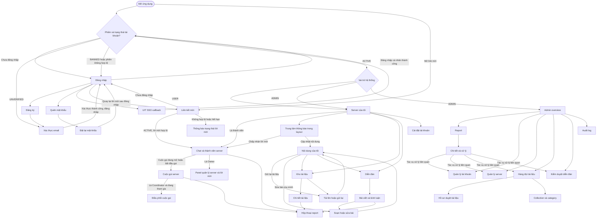

# Danh sách màn hình và luồng điều hướng — UIT Server Discord

Tài liệu mô tả **màn hình mục tiêu** theo [yêu cầu](../documents/requirement.md), [user stories](../documents/user-story.md), [kiến trúc](../documents/architecture.md), [kế hoạch triển khai](../plan/plan.md) và [schema dữ liệu](../DATABASE.txt). Các URL dưới đây là đề xuất cho frontend. “Công khai” ở kho tài liệu và diễn đàn nghĩa là dùng chung toàn hệ thống; người xem vẫn cần tài khoản `ACTIVE` theo quy tắc truy cập hiện tại.

## Bảng màu giao diện

### Hướng màu đã chốt

UIT Server Discord dùng **indigo trầm** làm màu thương hiệu, **slate** cho cấu trúc và bề mặt, cùng **coral trầm** cho các điểm nhấn xã hội. Dark theme là mặc định; light theme giữ cùng nhận diện nhưng dùng indigo và coral đậm hơn để bảo đảm độ tương phản. Tránh neon, gradient làm nền chính và mảng màu bão hòa lớn.

### Bảng màu lõi

| Nhóm | Token | HEX | Vai trò |
| --- | --- | --- | --- |
| Primary indigo | `--indigo-700` | `#373071` | Trạng thái nhấn, hover và active đậm. |
|  | `--indigo-600` | `#4338A3` | CTA chính trong light theme; dùng chữ trắng. |
|  | `--indigo-500` | `#5B55B8` | CTA chính trong dark theme, tab đang chọn và liên kết nổi bật. |
|  | `--indigo-100` | `#E8E7FB` | Nền nhấn nhẹ trong light theme. |
| Secondary slate | `--slate-900` | `#1C2230` | Chữ đậm trong light theme và bề mặt slate đậm. |
|  | `--slate-700` | `#3B4659` | Nút phụ tối, biểu tượng và viền mạnh. |
|  | `--slate-300` | `#C9D0DC` | Viền và trạng thái disabled trong light theme. |
|  | `--slate-100` | `#F0F2F6` | Bề mặt phụ trong light theme. |
| Accent coral | `--coral-700` | `#8E403A` | Chữ/biểu tượng coral trên nền sáng. |
|  | `--coral-600` | `#B3534B` | CTA coral trong light theme; dùng chữ trắng. |
|  | `--coral-400` | `#D47B72` | Nhấn trong dark theme; dùng chữ `#151A24`. |
|  | `--coral-100` | `#F8E7E4` | Nền badge và thông báo coral nhẹ. |
| Neutral | `--ink-950` | `#0F1218` | Canvas dark mặc định. |
|  | `--ink-900` | `#151A24` | Surface/card dark. |
|  | `--ink-800` | `#202737` | Surface nổi, menu và dialog dark. |
|  | `--paper-50` | `#F8F9FC` | Canvas light. |
|  | `--paper-0` | `#FFFFFF` | Card, menu và dialog light. |

### Token theo theme

| Vai trò | Dark theme mặc định | Light theme tùy chọn | Cách dùng |
| --- | --- | --- | --- |
| Canvas | `#0F1218` | `#F8F9FC` | Nền ứng dụng và vùng trống lớn. |
| Surface | `#151A24` | `#FFFFFF` | Sidebar, card, composer và bảng. |
| Surface raised | `#202737` | `#F0F2F6` | Popover, dialog, item hover và vùng phân tầng. |
| Text primary | `#F4F6FA` | `#1C2230` | Tiêu đề và nội dung chính. |
| Text secondary | `#B5BFCE` | `#58657A` | Mô tả, metadata và nhãn phụ. |
| Text muted | `#7F8A9C` | `#657187` | Placeholder, thời gian và trạng thái ít quan trọng. |
| Border | `#2B3445` | `#D8DEE8` | Phân tách surface và trạng thái input mặc định. |
| Primary | `#5B55B8` | `#4338A3` | Nút chính, tab/route đang chọn, liên kết quan trọng. |
| On primary | `#FFFFFF` | `#FFFFFF` | Chữ và icon trên primary. |
| Secondary | `#3B4659` | `#E8ECF3` | Nút phụ và control trung tính. |
| On secondary | `#F4F6FA` | `#1C2230` | Chữ và icon trên secondary. |
| Accent coral | `#D47B72` | `#B3534B` | Unread badge, lời mời, CTA cộng đồng và điểm nhấn có chủ đích. |
| On accent | `#151A24` | `#FFFFFF` | Chữ và icon trên accent coral. |
| Focus ring | `#9B96E8` | `#4338A3` | Focus keyboard rõ ràng cho control tương tác. |

### Màu trạng thái

| Trạng thái | Dark theme | Light theme | Cách dùng |
| --- | --- | --- | --- |
| Success | `#62B99C` | `#187B63` | Duyệt tài liệu/bài viết, thao tác thành công, kết nối ổn định. |
| Warning | `#DBAC5B` | `#94641D` | Nội dung chờ duyệt, token sắp hết hạn hoặc hành động cần chú ý. |
| Error | `#E17B87` | `#B4233A` | Validation, lỗi tải dữ liệu, từ chối hoặc tài khoản bị khóa. |
| Info | `#82A9D6` | `#2767A9` | Thông tin hệ thống, trạng thái đồng bộ hoặc hướng dẫn. |

### Quy tắc áp dụng

- Indigo chỉ dùng cho hành động chính và trạng thái đang chọn; không phủ indigo trên toàn bộ surface.
- Coral chỉ dùng cho lời mời, chưa đọc, reaction hoặc CTA cộng đồng; không dùng thay màu lỗi.
- Màu trạng thái luôn đi cùng nhãn, icon hoặc nội dung diễn giải. Chữ thường phải đạt tương phản tối thiểu 4.5:1 với nền.

## Bảng liệt kê trang

### Quy ước truy cập

| Ký hiệu | Điều kiện |
| --- | --- |
| Khách | Chưa có phiên đăng nhập hợp lệ. |
| User | Tài khoản UIT đã xác thực hoặc tài khoản cá nhân `ACTIVE`; Admin cũng có quyền này. |
| Member | User có membership còn hiệu lực trong server đang xem. |
| Owner | User có membership `OWNER` còn hiệu lực trong server đang xem. |
| Coordinator | Người đã khởi tạo **cuộc gọi hiện tại** và đang tham gia cuộc gọi; không đồng nghĩa với Owner. |
| Admin | User có `system_role = ADMIN`. |

### Xác thực và tài khoản

| Mã màn hình | Route đề xuất | Tên trang (`PageNameEnglish.tsx`) | Quyền | Mô tả chức năng |
| --- | --- | --- | --- | --- |
| A01 | `/login` | `LoginPage.tsx` | Khách | Đăng nhập tài khoản cá nhân hoặc bắt đầu đăng nhập UIT; hiển thị lỗi và trạng thái tài khoản phù hợp. |
| A02 | `/register` | `RegisterPage.tsx` | Khách | Tạo tài khoản bằng email cá nhân, mật khẩu và họ tên; hướng dẫn kiểm tra email xác thực. |
| A03 | `/verify-email` | `EmailVerificationPage.tsx` | Khách, `UNVERIFIED` | Xử lý liên kết/mã xác thực cho đăng ký hoặc đổi email; hiện kết quả, trạng thái hết hạn và cách gửi lại. |
| A04 | `/forgot-password` | `ForgotPasswordPage.tsx` | Khách | Gửi yêu cầu đặt lại mật khẩu; luôn hiển thị phản hồi chung, không tiết lộ email có tồn tại. |
| A05 | `/reset-password` | `ResetPasswordPage.tsx` | Khách | Đặt mật khẩu mới bằng token một lần; xử lý token hết hạn/đã dùng và quay về đăng nhập. |
| A06 | `/auth/uit/callback` | `UitSsoCallbackPage.tsx` | Khách | Hoàn tất callback UIT SSO, tạo phiên ứng dụng hoặc hiển thị lỗi/hủy đăng nhập an toàn. |
| A07 | `/invite/:token` | `ServerInvitePage.tsx` | Khách, User | Xem lời mời qua liên kết, đăng nhập nếu cần, xác nhận tham gia; hiển thị hết hạn, hết lượt, đã thu hồi hoặc đã là thành viên. |
| A08 | `/settings/account` | `AccountSettingsPage.tsx` | User | Xem/sửa hồ sơ; tài khoản cá nhân đổi mật khẩu hoặc yêu cầu đổi email và xác thực lại. |

### Không gian người dùng

| Mã màn hình | Route đề xuất | Tên trang (`PageNameEnglish.tsx`) | Quyền | Mô tả chức năng |
| --- | --- | --- | --- | --- |
| U01 | `/servers` | `ServerListPage.tsx` | User | Xem và chuyển giữa **các server mình tham gia**; tạo server mới; không có tìm kiếm server công khai. |
| U02 | `/servers/:serverId` | `ServerPage.tsx` | Member của server | Một luồng chat chung, lịch sử, soạn/sửa/xóa tin và reaction; xem thành viên, trạng thái cuộc gọi. Owner quản lý thông tin server, thành viên và lời mời trong các panel tại đây. |
| U03 | `/servers/:serverId/call` | `ServerCallPage.tsx` | Member của server | Sảnh tham gia và cuộc gọi đang hoạt động: thiết bị, danh sách người tham gia, âm thanh/video, chia sẻ màn hình và chat server. Chỉ Coordinator đang tham gia thấy quyền cưỡng chế tắt mic/chia sẻ. |
| U04 | `/documents` | `DocumentLibraryPage.tsx` | User | Tìm tài liệu đã duyệt theo tiêu đề, tag, collection hoặc nội dung OCR; lọc theo collection/category và mở chi tiết. |
| U05 | `/documents/:slug` | `DocumentDetailPage.tsx` | User | Xem mô tả, tag, collection và bản xem trước; tải qua URL có thời hạn, chia sẻ liên kết vào server hoặc report tài liệu. |
| U06 | `/documents/new`, `/documents/:id/resubmit` | `DocumentSubmissionPage.tsx` | User | Tải tệp và nhập thông tin; theo dõi tiến trình, gửi lại tài liệu bị từ chối với lý do hiển thị rõ. |
| U07 | `/my-content` | `MyContentPage.tsx` | User | Hai tab “Tài liệu” và “Bài viết”: xem trạng thái xử lý/duyệt, lý do từ chối, lịch sử nộp và lối tắt sửa/gửi lại. |
| U08 | `/forum` | `ForumFeedPage.tsx` | User | Xem và tìm bài đã duyệt theo một hoặc nhiều chủ đề; mở bài viết hoặc bắt đầu bài mới. |
| U09 | `/forum/:postId` | `ForumPostPage.tsx` | User | Đọc bài và chuỗi bình luận, trả lời, reaction, đăng bình luận ẩn danh khi được phép; chia sẻ vào server hoặc report bài/bình luận. |
| U10 | `/forum/new`, `/forum/:postId/edit` | `ForumPostEditorPage.tsx` | User; chỉ tác giả khi sửa | Viết/sửa bài, gắn chủ đề tự do, chọn ẩn danh và gửi duyệt; bài đã sửa quay lại trạng thái chờ duyệt. |

### Quản trị

| Mã màn hình | Route đề xuất | Tên trang (`PageNameEnglish.tsx`) | Quyền | Mô tả chức năng |
| --- | --- | --- | --- | --- |
| M01 | `/admin` | `AdminOverviewPage.tsx` | Admin | Tổng quan số liệu hữu hạn và lối tắt tới hàng đợi report, tài liệu, bài viết cần xử lý. |
| M02 | `/admin/reports` | `AdminReportsPage.tsx` | Admin | Lọc report theo trạng thái, người phụ trách và loại đối tượng; mở vụ việc cần xử lý. |
| M03 | `/admin/reports/:reportId` | `AdminReportDetailPage.tsx` | Admin | Xem bằng chứng bất biến, phân công và kết luận report; chỉ mở nội dung riêng tư liên quan sau khi nêu mục đích, để hệ thống ghi audit. |
| M04 | `/admin/accounts` | `AdminAccountsPage.tsx` | Admin | Tìm tài khoản, xem trạng thái, khóa/gỡ khóa và gửi thông báo một chiều cho từng người. |
| M05 | `/admin/servers` | `AdminServersPage.tsx` | Admin | Xử lý server vi phạm: xem metadata/thành viên cần thiết, mời hoặc kick người dùng, hủy server với lý do. Không có quyền duyệt toàn bộ chat riêng tư. |
| M06 | `/admin/documents` | `AdminDocumentsPage.tsx` | Admin | Danh sách tài liệu theo trạng thái xử lý, chờ duyệt, đã duyệt, từ chối hoặc đã gỡ; vào hồ sơ duyệt. |
| M07 | `/admin/documents/:submissionId` | `AdminDocumentReviewPage.tsx` | Admin | Xem tệp và OCR có phân quyền, so sánh đề xuất AI; chọn collection/category/tag cuối cùng, duyệt hoặc từ chối có lý do, gỡ tài liệu đã công khai khi cần. |
| M08 | `/admin/document-taxonomy` | `AdminDocumentTaxonomyPage.tsx` | Admin | Quản lý collection và category dùng cho phân loại tài liệu; tạo/sửa và gán category cho collection. |
| M09 | `/admin/forum` | `AdminForumModerationPage.tsx` | Admin | Hàng đợi bài viết và nội dung bị report; xem đề xuất AI, duyệt/từ chối/sửa/gỡ nội dung. Chỉ tiết lộ danh tính ẩn danh khi có mục đích kiểm duyệt và ghi audit. |
| M10 | `/admin/audit-logs` | `AdminAuditLogPage.tsx` | Admin | Tra cứu nhật ký thao tác quản trị và truy cập dữ liệu nhạy cảm theo người thực hiện, đối tượng và thời gian; chỉ đọc. |

## State Graph

### Chuyển trạng thái trong từng luồng

| Luồng | Trạng thái/điều kiện cần thể hiện trên giao diện |
| --- | --- |
| Phiên | `UNVERIFIED` chỉ vào xác thực email; `BANNED` không tạo phiên; hết hạn phiên thì về đăng nhập và xóa dữ liệu riêng đã lưu ở frontend. Quyền Admin luôn được backend kiểm tra lại. |
| Lời mời | Từ thông báo: chấp nhận/từ chối. Từ liên kết: hợp lệ → tham gia server; hết hạn/hết lượt/thu hồi/đã là thành viên → trạng thái giải thích ngay trên `ServerInvitePage.tsx`. |
| Chat và gọi | Chat chỉ dành cho thành viên; khi kết nối lại, đồng bộ tin đã lưu. Mỗi server có một cuộc gọi, tối đa 30 người và một người chia sẻ màn hình. Call Coordinator vắng mặt thì ẩn/vô hiệu hóa quyền điều phối. |
| Tài liệu | `PENDING_PROCESSING` → `PENDING_REVIEW` → `APPROVED`/`REJECTED`; chỉ tài liệu `PUBLIC` xuất hiện trong kho. Bị từ chối → gửi lại thành lần nộp mới; bị gỡ → không còn xem/tải công khai. AI chỉ gợi ý phân loại. |
| Diễn đàn | `PENDING_REVIEW` → `APPROVED`/`REJECTED`; sửa bài đã duyệt → trở lại chờ duyệt. Chỉ bài đã duyệt hiện trong feed và cho phép bình luận; bí danh ẩn danh ổn định trong cùng một bài. AI chỉ gợi ý kiểm duyệt. |
| Report | `OPEN` → `IN_REVIEW` → `RESOLVED`/`DISMISSED`. Form report mở từ đối tượng liên quan; report hành vi cuộc gọi ghi người bị báo cáo, thời điểm và hành vi, không có bản ghi cuộc gọi. |

Thông báo mở qua chuông trong layout dùng chung (có thể là drawer), cho phép đọc/xóa và xử lý lời mời trực tiếp; tạo server, mời người dùng, report, reaction và xác nhận thao tác là form/panel/dialog trong màn hình liên quan. Không cần route riêng cho các thao tác này, cho AI Agent, danh mục server công khai, tin nhắn riêng, nhiều channel hoặc lịch sử cuộc gọi ghi hình.
